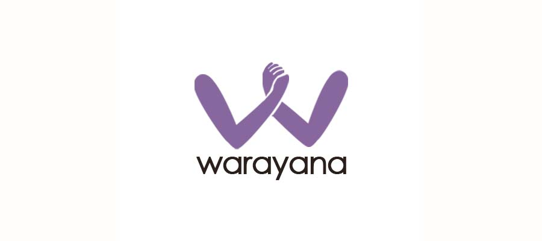
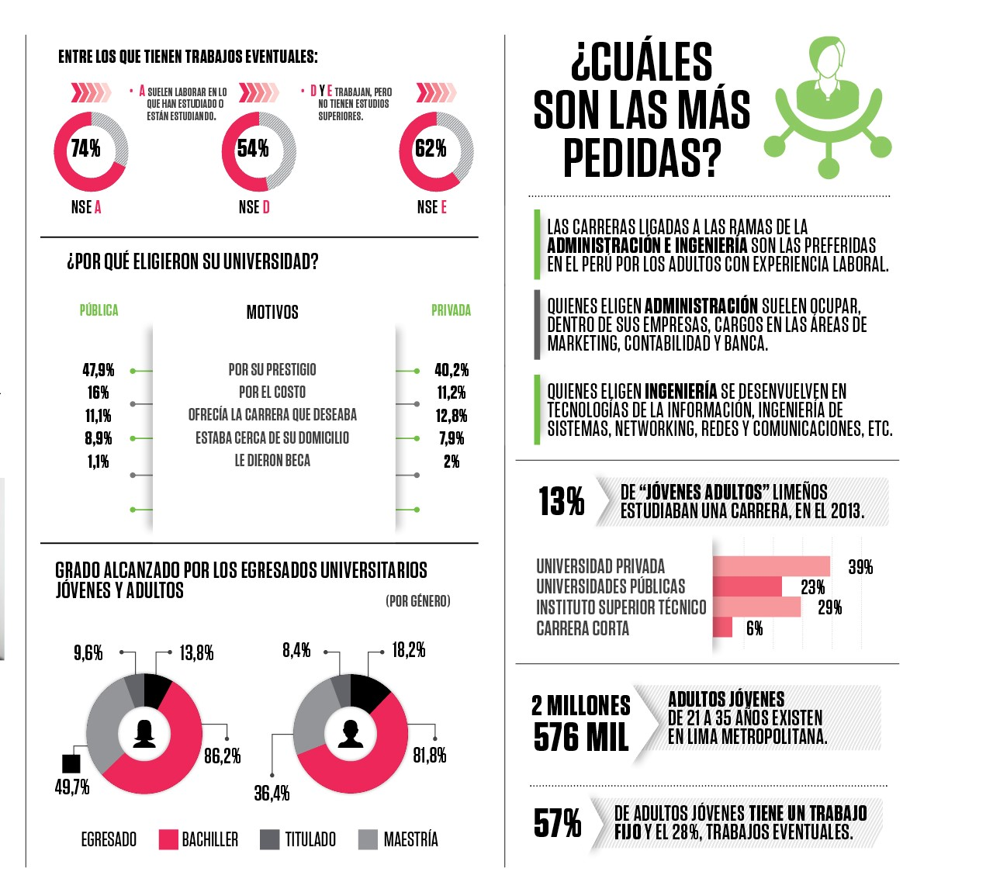
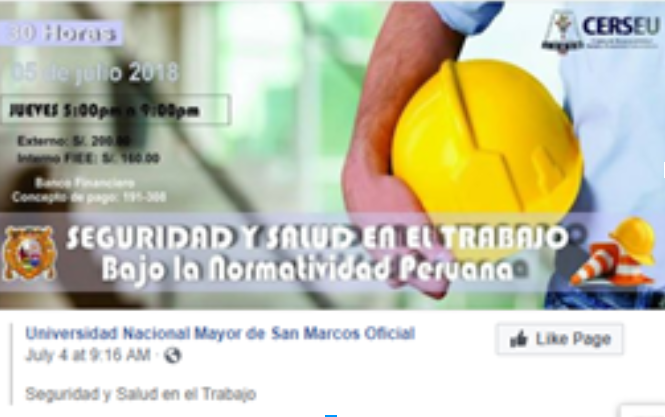
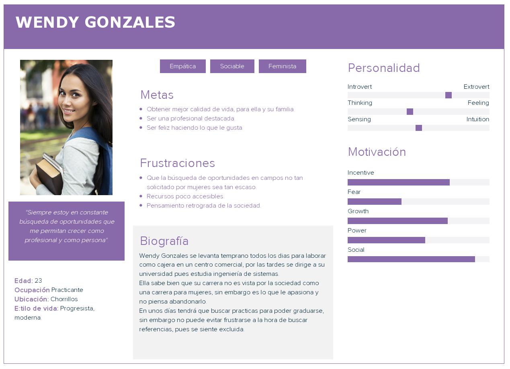
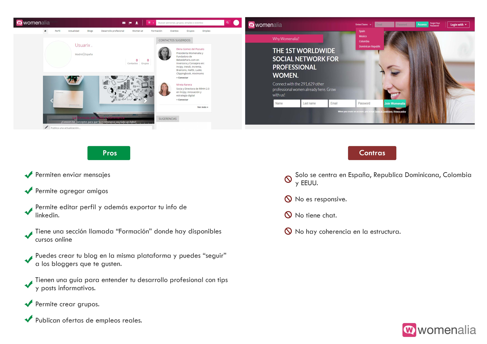
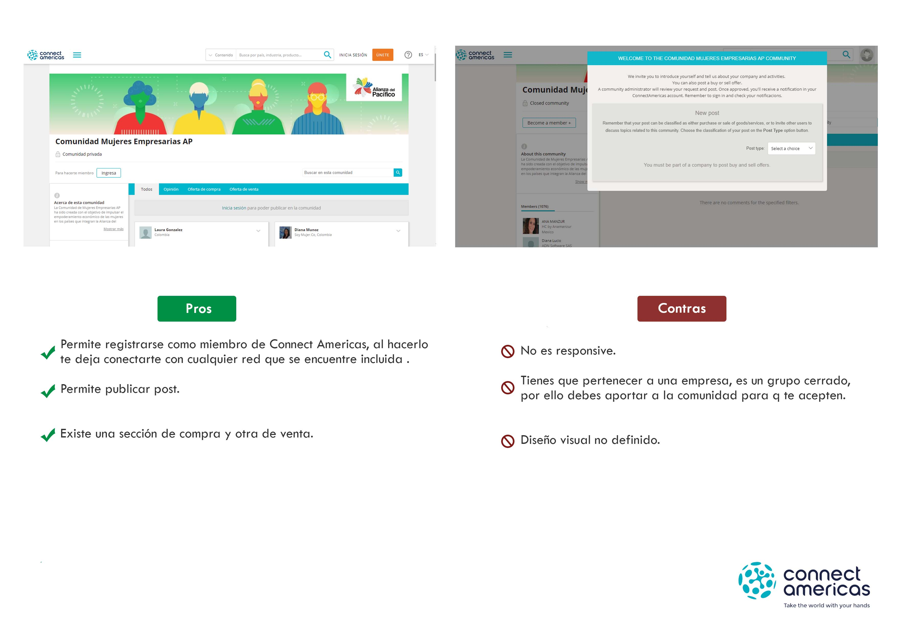
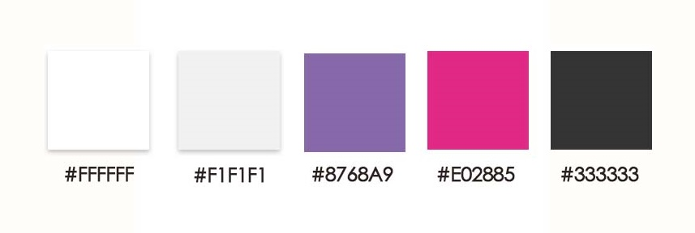
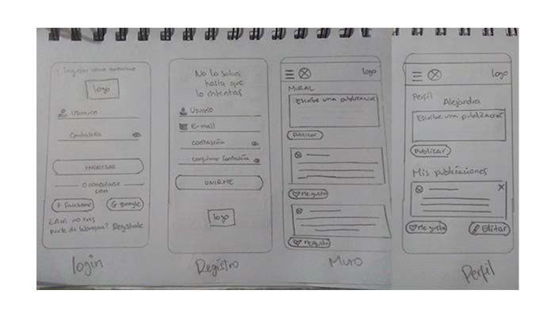
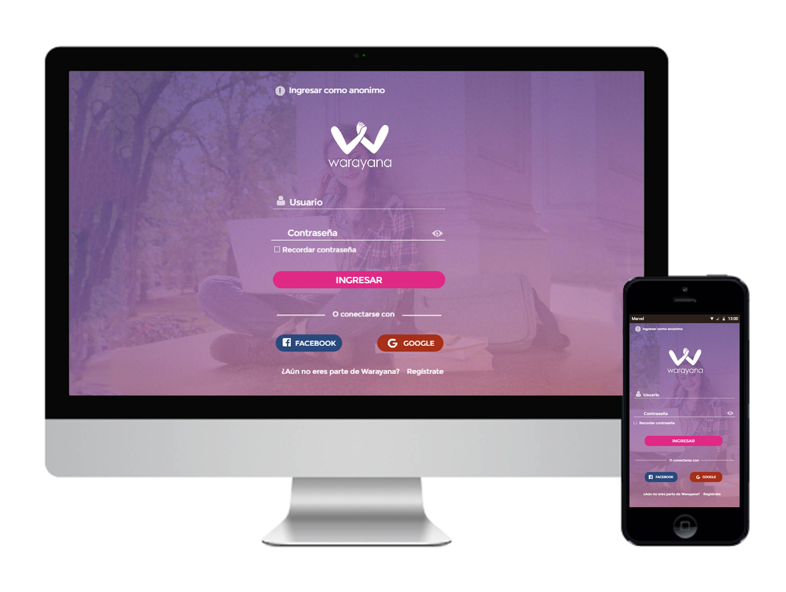
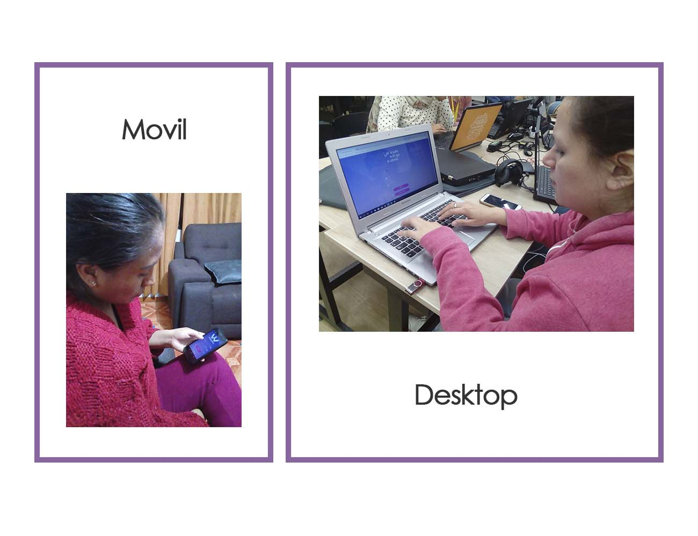

# SOCIAL NETWORK - Warayana




### PREAMBULO

Es difícil encontrar oportunidades para desarrollarse profesionalmente siendo mujer y/o madre. 
Las causas para este problemática se han analizado desde dos ámbitos. El primero es la discriminación que se da en el mercado laboral que está ampliamente documentada y se da cuando dos trabajadores igualmente productivos reciben compensaciones diferentes únicamente por cuenta de su sexo, y la segunda se enfoca en patrones psicológicos que pueden incidir en el mercado laboral. estas diferencias en patrones psicológicos no se deben sólo a aspectos biológicos, sino también a normas sociales que construyen identidades.

### INTRODUCCIÓN

Según un [estudio de la INEI](https://peru21.pe/lima/peru-avances-concretos-politicas-igualdad-genero-65462), verificamos los siguientes datos estadisticos:

```text
_Las mujeres ganan un promedio de 29.7% menos que los hombres por el mismo trabajo.

_Por cada hombre existen 3 mujeres analfabetas.

_El ingreso promedio de las mujeres es 1,279 soles mientras que el de los hombres son de 1,901.
_El 31.9% de las mujeres mayores de 14 años no tiene ingresos propios.
_Casi la mitad de las mujeres de las zonas rurales (47%) no tiene ingresos propios.

_ En 73.1% de los hombres logran culminar sus estudios secundarios mientras que las mujeres son el 61.5%.

En este proyecto tendremos la oportunidad de acercarnos más a fondo a los futuros usuarios de la red social que son mujeres que tienes los mismos intereses que es disminiur esta brecha que existe en la desigualdad de género en el ámbito educativo y laboral.

```



### DEFINICIÓN DEL PRODUCTO

**Elementos basicos de una red social:**

* Elemento Sociologico:
Nuestros usuarios podran conectarse a nuestra red social facilmente, tan solo contando con una conexión a internet, comenzando asi a entablar comunicación con otros usuarios, obteniendo información y compartiendo información de interes.
* Elemento tecnologico:
Esta red social puede ser usada en dispositivos moviles, desktop y tablets,
gracias a su diseño resposive.
* Elemento Juridico:
Los datos registrados en nuestra aplicación son confidenciales, solo se mostraran
los nombres de cada usuario y el post publicado tendrá la opción de privacidad.

**Principales usuarios:** 

Nuestros principlaes usuarios son mujeres de 18 años a más, solteras o madres de familia que esten en busqueda de superación personal en el ámbito laboral y de educación.

**Descubriendo necesidades de los usuarios:**

 Encontramos como necesidad la creación de nuevos espacios donde podamos encontrar y compartir recursos, participar de eventos, entre otros, que nos permitan desarrollarnos con libertad y sin prejuicio en todas las profesiones al igual que los hombres, teniendo las mismas oportunidades sin distinción.

**Problema a resolver:**

La situación de desventaja que mantenemos las mujeres hoy en día en ámbitos de educación y laboral.

**Objetivos de los usuarios en relación con el producto:**

* Compartir información relevante como: eventos estudiantiles, convocatorias de trabajo, seminarios gratuitos, etc.
* Mantener comunicación activa con personas interesadas sobre el tema.
* Sentirán un equilibrio de oportunidades.

**Principales funcionalidades del producto:**

* Publicar un post.
* Poder poner like a una publicación.
* Llevar un conteo de los likes.
* Poder eliminar un post específico.
* Poder publicar y mostrar los posts que son sólo para mi y para todo público.
* Pedir confirmación antes de eliminar un post.
* Al darle click en el botón editar, debe cambiar el texto por un input que permita editar el texto y cambiar el link por guardar.
* Al darle guardar debe cambiar de vuelta a un texto normal pero con la información editada.
* Al recargar la página se observa los posts editados

**Verificando que el producto resuelva la problematica:**

Realizamos una encuesta el cual detallaremos líneas abajo, en donde el %90.9 de los posibles usuarios encuestados respondieron que les interesaría ser parte de una red social que empodere a mujeres en ambitos laborales y de educación.

**Cómo nos aseguramos del uso del producto:**

Haremos uso de las redes sociales más usadas por nuestros usuarios para realizar publicidad que impacte y genere recordación de marca mediante influencers representativas al feminismo.

### USER EXPERIENCE DESIGN

**Proceso de diseño**

**Reseach:**

Identificamos las necesidades de los usuarios y buscamos data e inspiración para diseñar nuestro producto.

*Entrevistas*

--------------------------------------------------------------

GUIA DE ENTREVISTA

I. Antes de la entrevista

Familiarízate con las secciones y tiempos, y preguntas a realizar
Trata de agendar la entrevist a en un lugar tranquilo y sin ruido.
Asegúrate de tener tu móvil listo para grabar.

II. Durante

Buenos (días,tardes, noches)(nombre del entrevistado )¿Cómo estás? ¿Cómo te fue en tu día hoy?
Bueno durante estos  30 minutos que vamos a pasar juntas quiero que me practiques sobre tus experiencias cuando estas navegando en las redes sociales. Lo que queremos aprender son como son tus hábitos, que es lo que atrae y que es lo primero que buscas.

Preguntas:

1.    Cuentame. ¿Qué redes sociales usas? ¿Por qué?
2.    Califique de 1 a 5 que tan importante son las redes sociales para usted
3.    Para qué utilizas las redes sociales
4.    ¿Qué es lo que más te gusta de ellas?
5.    ¿Cuánto tiempo paras al día en promedio en las redes sociales? %porcentaje de tu día en redes sociales
6. 	¿Qué es lo que sueles buscar en una red social? ¿Por qué?
7. 	¿Cuántas veces al día públicas en las redes sociales?
8. 	¿Qué piensas del feminismo?
9. 	¿Alguna vez has sentido (o visto) que las mujeres no tenemos las mismas oportunidades en áreas de educación o laboral? Cuéntame un poco más de ello.
10. ¿Conoces alguna red social dedicada a brindar oportunidades en educación y desarrollo laboral solo a mujeres?
11. ¿Si ves esta imagen en una red social para público general a que publico piensas que está dirigido? 	



12. ¿Qué percepción tienes sobre una red social que busquen empoderar a mujeres en el ámbito laboral y de educación?

13. ¿Crees que sería útil una red social como esta?

14. ¿Qué temas esperarías que se compartan en una red social como esta?

--------------------------------------------------------------
 
 **Conclusiones de las entrevistas**

 * Los entrevistados señalaron que la red social que mas usaban era facebook.
 * Realizan busquedas sobre la carrera que estudian o ejercen.
 * Sobre el feminismo algunos tienen algun concepto correcto del significado y otros tenian un concepto erroneo.
 * Se mostraron interesados en la propuesta de una red social como wrayana.

 [Ver entrevistas](https://drive.google.com/drive/folders/10ZcuM8zA0KK0vp67NaK_mPAsLmezZ3sx)
---------------------------------------------------------------
GUIA DE ENCUESTA

1. ¿Qué edad tienes? 
2. ¿Con qué género te identificas?
    
    a. Femenino
    b. Masculino
    c. Otro:

3. ¿Cuáles son las redes que más utilizas? 
    a. Facebook
    b. Instagram
    c.Twitter
    d.Linkedin
    e. Whatsapp
    f. Otro:
4. ¿Con qué frecuencia usas al día cada red social? 
a. Nunca   
b. Casi nunca      	
c.1 a 2 veces     	
d. Todo el tiempo
5. ¿En qué dispositivo utilizas más tus redes sociales?
a. celular
b. tablet
c. computadora
6. ¿Conoces alguna red social dedicada a brindar oportunidades en educación y desarrollo laboral solo a mujeres? 
a. Sí
b. No
c. Otro:
d. Si conoces alguna, ¿cuál es?
7. ¿Te gustaría ser parte de una red social que busquen empoderar a mujeres en el ámbito laboral y de educación? Donde pudieras ver y compartir artículos, conocer herramientas, recursos y más para mujeres.
a. Sí
b. No
8. ¿Qué tipo de actividades te gustaría realizar dentro esta red social? puedes marcar más de una opción
a. Conocer más mujeres como yo.
b. Subir y bajar información (fotos, videos y textos) relacionados a educación y oportunidad laboral para mujeres.
c. Organizar, participar de eventos(talleres, meetups, etc).
d. Otro:

-------------------------------------------------------------
**Conclusiones de las encuestas**

* Son tres las redes sociales más usadas por los usuarios: whatsApp **%87**, Facebook **%70** e instagram **%48**.
* Entre los dispositivos que más usan son: Celular **%91** y computadora **%9**.
* El **%100** no conoce alguna red social parecida, sin embargo al **%92** desea pertenecer a esta iniciativa.
* El **%74** desearía organizar y/o paraticipar de eventos estudiantiles o laborales, mientras que el **%48** quiere subir y bajar información (fotos, videos) y el **%43** desea conocer personas con sus mismos intereses.

 [Puedes ver aquí los resultados](https://docs.google.com/spreadsheets/d/1OXFoqPzarPXW7hcsKQvPC--SVJdbDnwtsCLuFnFZGiM/edit#gid=1020016358)

---------------------------------------------------------------
**Síntesis y definición:**

Usamos los datos coleccionados en la fase de research buscando tendencias e insights valiosos para el desarrollo del producto.

*user persona*



**Ideación:**

En esta fase buscamos las mejores maneras para ejecutar/desarrollar las funcionalidades definidas en la fase de ideación.

*Benchmarck*





*Elección de colores*

Partimos por elegir el color violeta que es el color representativo del feminismo para luego buscar colores que convinen con esta, para ello se uso la herramienta [Coolers.co](https://coolors.co/)



*Elección de tipografía*

Elegimos Montserrat ya que es una tipografía moderna y bastante neutra, adaptandose muy bien en cualquier situación.


**Prototipado:**

Elaboramos un prototipo que nos permita probar nuestras ideas con usuarios para saber si estamos resolviendo/satisfaciendo sus necesidades con nuestro producto.

*Prototipo de baja fidelidad*



*Prototipo de alta fidelidad*

Para elaborar este prototipo usamos la herramienta [Marvelapp](https://marvelapp.com/).

[Versión Movil](https://marvelapp.com/41553eg/screen/46203888)

[Versión Desktop](https://marvelapp.com/3b9ba2a/screen/46390107)




**User Testing:**

Probamos nuestros prototipo con usuarios para obtener su feedback.

Conclusiones:

* El usuario ubica y reconoce secciones en la pagina web como logeo, perfil y muro.
* Para su comodidad, prefiere logearse con facebook.
* Entiende que hay un enlace donde puede ingresar sin registrarse.
* El usuario pensó que el simbolo del ojo era algun logo o icono y no le dio importancia, piensa que no es util.

[Ver el testing](https://drive.google.com/open?id=1gUJdO7M87Zl-2q_AMGMBKWriep4S9tXL)

**Testing HTML**



Se observó lo siguiente:

* Pudieron registrarse con facilidad.
* Pudieron ingresar con google y facebook, sin problemas.
* Al ingresar a su cuenta pudieron realizar una publicación o varias 
en modo privado o publico.
* Se pudo editar una publicacion realizada y tambien eliminarla sin 
ningun problema.
* Pudieron darle like a su post.

Conclusiones:

Pudimos comprobar que las funcionalidades de nuestra red social 
cumplian su función.

Se sugirió por parte de una usuaria, que se debería adicionar la opción
de deslike a una publicación.

## Referencias:

* [Periodico Feminista](http://www.mujeresenred.net/)
* [Grupo de Wikimujeres](http://wikimujeres.wiki/)
* [Facebook Feminista](https://www.facebook.com/patrullafeminista/)
* [Radio Feminista](https://radiorecuperandomemoria.com/2017/06/09/el-feminismo-y-las-redes-sociales/)
* [Blog feminista](https://www.buzzfeed.com/badge/lola?utm_term=.qgEroz9xDx#.fbZJPoKkpk)
