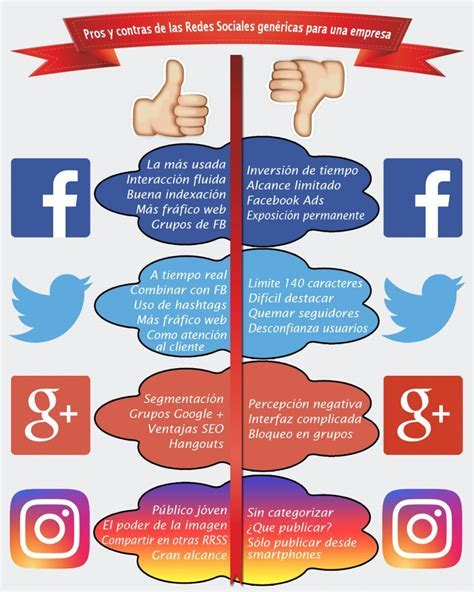

# SocialNetwork - Warayana

### Tema: Educación/feminismo


## Preámbulo:

Instagram, Snapchat, Twitter, Facebook, Twitch, Linkedin, etc. Las redes
sociales han invadido nuestras vidas. Las amamos u odiamos, y muchxs no podemos
vivir sin ellas.

Hay redes sociales de todo tipo y para todo tipo de intereses. Por ejemplo,
en una ronda de financiamiento con inversionistas, se presentó una red social
para químicos en la que los usuarios podían publicar artículos sobre sus
investigaciones, comentar en los artículos de sus colegas, y filtrar artículos
de acuerdo a determinadas etiquetas o su popularidad, lo más reciente, o lo
más comentado.

## Introducción

Una emprendedora nos ha encargado crear una red social. No nos da mucho detalle
sobre qué tipo de red social quiere, sólo nos dice que creemos la mejor que
podamos, y que luego la convenzamos de lanzarla al mercado. Nos da ciertos temas
en los que le gustaría invertir:

* Alimentación
* Feminismo
* Educación
* Salud
* Energías Renovables

## Objetivo

Warayana es una red social que esta enfocada en buscar el empoderamiento femenino en el ámbito laboral y de educación.
Que la población femenina encuentre oportunidades de manera más fácil y directa; oportunidades para desarrollarse, como cursos, seminarios, talleres, empleos.
También puedan encontrar a más mujeres que tengan los mismos interés  que ellas.

## Público beneficiado

Femenino

## Público registrado  

Ambos sexos

## Problema a resolver

Es difícil encontrar oportunidades para desarrollarse profesionalmente siendo mujer y/o madre. 
Las causas para este problemática se han analizado desde dos ámbitos. El primero es la discriminación que se da en el mercado laboral que está ampliamente documentada y se da cuando dos trabajadores igualmente productivos reciben compensaciones diferentes únicamente por cuenta de su sexo, y la segunda se enfoca en patrones psicológicos que pueden incidir en el mercado laboral. estas diferencias en patrones psicológicos no se deben sólo a aspectos biológicos, sino también a normas sociales que construyen identidades.

## Introducción

Según un [estudio de la INEI](https://peru21.pe/lima/peru-avances-concretos-politicas-igualdad-genero-65462), verificamos los siguientes datos estadisticos:

```text
_Las mujeres ganan un promedio de **29.7% menos** que los hombres por el mismo trabajo.

_Por cada hombre existen 3 mujeres analfabetas.

_El ingreso promedio de las mujeres es 1,279 soles mientras que el de los hombres son de 1,901.
_El **31.9%** de las mujeres mayores de 14 años no tiene ingresos propios.
_Casi la mitad de las mujeres de las zonas rurales **(47%)** no tiene ingresos propios.

_ En **73.1%** de los hombres logran culminar sus estudios secundarios mientras que las mujeres son el **61.5%**.

En este proyecto tendremos la oportunidad de acercarnos más a fondo a los futuros usuarios de la red social que son mujeres que tienes los mismos intereses que es disminiur esta brecha que existe en la desigualdad de género en el ámbito educativo y laboral.

```


## User Experience Design:

### Proceso de diseño

**RESEARCH**

Identificamos las necesidades de los usuarios y buscamos data e inspiración para diseñar nuestro producto.

**Entrevistas**

**Muestra de la población:** 7 personas quienes constituyen los usuarios primarios y usuarios secundarios(4 chicas estudiantes , 2 joven varones, 1 papa, 1 mama) para que abarquen todos los escenarios posibles

**Usuario Primario:** Son todas las mujeres sin límites de edad que quieran encontrar información referente a la educación para que promueva el empoderamiento femenino en ámbitos laborales y de educación.

**Usuario Secundario:** Son todas las personas sin límites de edad que quieran encontrar información para un persona de sexo femenino que se sienta en la necesidad de encontrar nuevas oportunidades en el sector de la educación.

#### Guía de Entrevista

**I. Antes de la entrevista:**

Familiarízate con las secciones y tiempos, y preguntas a realizar
Trata de agendar la entrevist a en un lugar tranquilo y sin ruido.
Asegúrate de tener tu móvil listo para grabar.

**II. Durante:**

Buenos (días,tardes, noches)(nombre del entrevistado )¿Cómo estás? ¿Cómo te fue en tu día hoy?
Bueno durante estos  30 minutos que vamos a pasar juntas quiero que me practiques sobre tus experiencias cuando estas navegando en las redes sociales. Lo que queremos aprender son como son tus hábitos, que es lo que atrae y que es lo primero que buscas.

Preguntas:

1.    Cuentame. ¿Qué redes sociales usas? ¿Por qué?
2.    Califique de 1 a 5  tan importante son las redes sociales para usted
3.    Para qué utilizas las redes sociales
4.    ¿Qué es lo que más te gusta de ellas?
5.    ¿Cuánto tiempo paras al día en promedio en las redes sociales? %porcentaje de tu día en redes sociales
6. 	¿Qué es lo que sueles buscar en una red social? ¿Por qué?
7. 	¿Cuántas veces al día públicas en las redes sociales?
8. 	¿Qué piensas del feminismo?
9. 	¿Alguna vez has sentido (o visto) que las mujeres no tenemos las mismas oportunidades en áreas de educación o laboral? Cuéntame un poco más de ello.
10. ¿Conoces alguna red social dedicada a brindar oportunidades en educación y desarrollo laboral solo a mujeres?
11. ¿Si ves esta imagen en una red social para público general a que publico piensas que está dirigido? 	


12. ¿Qué percepción tienes sobre una red social que busquen empoderar a mujeres en el ámbito laboral y de educación?

13. ¿Crees que sería útil una red social como esta?

14. ¿Qué temas esperarías que se compartan en una red social como esta?

--------------------------------------------------------------
 
#### Guia de Encuesta

1. ¿Qué edad tienes? 
2. ¿Con qué género te identificas?
    
    a. Femenino
    b. Masculino
    c. Otro:

3. ¿Cuáles son las redes que más utilizas? 
    a. Facebook
    b. Instagram
    c.Twitter
    d.Linkedin
    e. Whatsapp
    f. Otro:
4. ¿Con qué frecuencia usas al día cada red social? 
a. Nunca   
b. Casi nunca      	
c.1 a 2 veces     	
d. Todo el tiempo
5. ¿En qué dispositivo utilizas más tus redes sociales?
a. celular
b. tablet
c. computadora
6. ¿Conoces alguna red social dedicada a brindar oportunidades en educación y desarrollo laboral solo a mujeres? 
a. Sí
b. No
c. Otro:
d. Si conoces alguna, ¿cuál es?
7. ¿Te gustaría ser parte de una red social que busquen empoderar a mujeres en el ámbito laboral y de educación? Donde pudieras ver y compartir artículos, conocer herramientas, recursos y más para mujeres.
a. Sí
b. No
8. ¿Qué tipo de actividades te gustaría realizar dentro esta red social? puedes marcar más de una opción
a. Conocer más mujeres como yo.
b. Subir y bajar información (fotos, videos y textos) relacionados a educación y oportunidad laboral para mujeres.
c. Organizar, participar de eventos(talleres, meetups, etc).
d. Otro:

**SÍNTESIS Y DEFINICIÓN**

Usamos los datos coleccionados en la fase de research buscando tendencias e insights valiosos para el desarrollo del producto.

**IDEACIÓN**

En esta fase buscamos las mejores maneras para ejecutar/desarrollar las funcionalidades definidas en la fase de ideación. Se elaboran sketches y se decide qué propuesta se ejecutará.

*Benchmarck*




**PROTOTIPADO**

Elaboramos un prototipo que nos permita probar nuestras ideas con usuarios para saber si estamos resolviendo satisfaciendo sus necesidades con nuestro producto.

**USER TESTING**

Probamos nuestros prototipos con usuarios para obtener su feedback.


## Referencias:

* [Periodico Feminista](http://www.mujeresenred.net/)
* [Grupo de Wikimujeres](http://wikimujeres.wiki/)
* [Facebook Feminista](https://www.facebook.com/patrullafeminista/)
* [Radio Feminista](https://radiorecuperandomemoria.com/2017/06/09/el-feminismo-y-las-redes-sociales/)
* [Blog feminista](https://www.buzzfeed.com/badge/lola?utm_term=.qgEroz9xDx#.fbZJPoKkpk)

